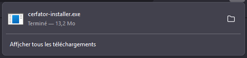
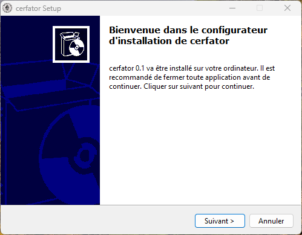
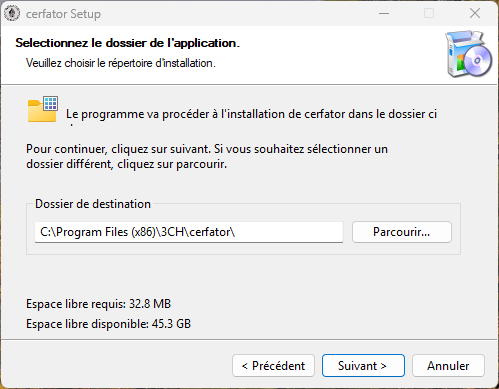
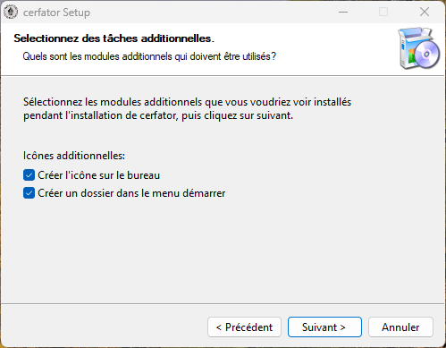
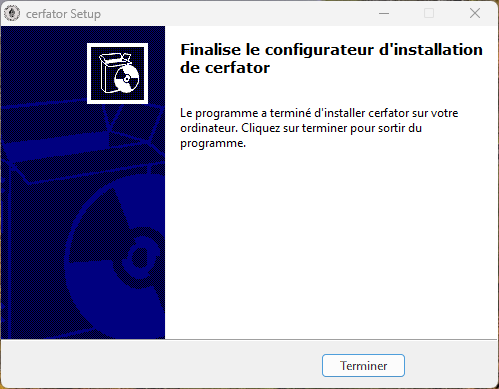
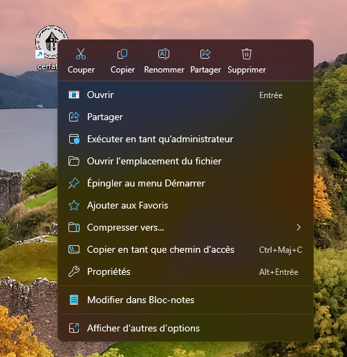
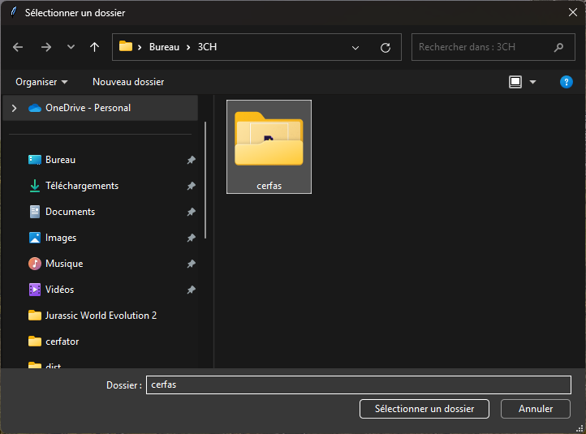
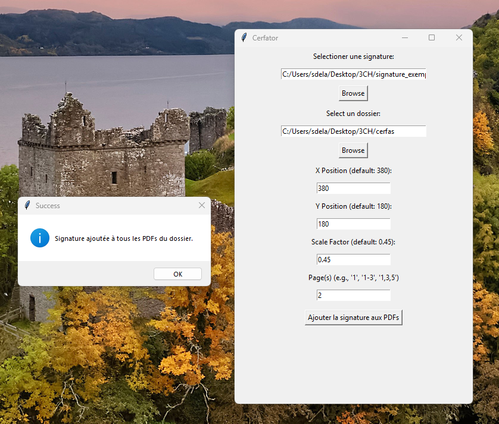
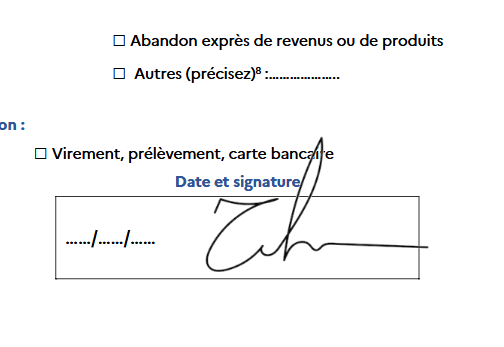

# cerfator

Installer sous windows

Télécharger l'installeur en cliquant sur le lien ci dessous

https://github.com/CommanderieCondat/cerfator/releases/download/0.1/cerfator-installer.exe

lancer `cerfator-installer.exe` et répondre oui à la question suivante

Vous-vous autoriser cette application provenant d'un éditeur inconnu à apporter des modifications à votre ordinateur? -> `OUI`

cliquez sur suivant

cliquez sur suivant

cliquez sur suivant

cliquez sur Terminer

un icone au logo de la Commanderie nommé cerfator doit être apparu sur le bureau, faites un click droit sur celui-ci

sélectionner éxécuter en tant qu'administrateur et répondre OUI à la question suivante

Vous-vous autoriser cette application provenant d'un éditeur inconnu à apporter des modifications à votre ordinateur? `OUI`

L'appliaction cerfator doit normalement apparaitre

Sous le label "Sélectioner une signature" cliquer sur "Browse" et sélecioner la signature que vous souhaitez insérer

Sous le label "Sélectioner un dossier" cliquer sur "Browse" et sélectioner le dossier dans le lequel sont placés les PDFs dans lesquels insérer la singature, !attention à n'y placer que les PDFs!

Cliquer sur "Ajouter la signature aux PFDs", si toute les étapes ci-dessus ont été respectées, une fenêtre de dialogue devrait indiquer le succés de l'opération

et dans chaque cerfa a été inséré la signature sélectionée

